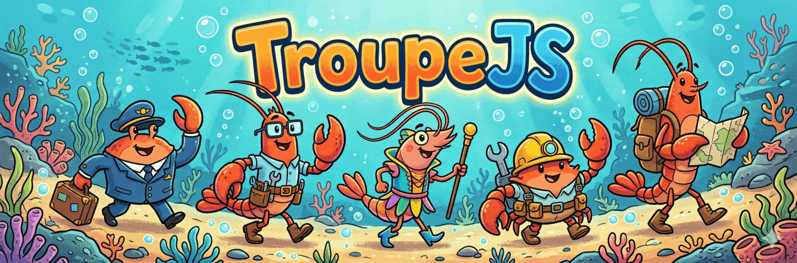

# TroupeJS

TroupeJS is a TypeScript library for building multi-agent applications with minimal setup and configuration.

It provides a clean, class-based API for creating agents that can communicate, collaborate, and reason together. At the same time, it supports more advanced capabilities like tools, structured discussions, and memory systems.

You can start simple and scale to more complex agent systems without changing the core design.

---

## Features

### 🧠 Troupes (Collaborative Agent Groups)
Create *troupes*, which are groups of agents that discuss and work together on a task.  
Agents run in parallel, share context, and produce structured responses.

### 🔁 Agent-to-Agent Communication
Agents can respond to each other and build on previous outputs, enabling more dynamic and iterative reasoning.

### 🧩 Subagents
Attach subagents to an agent to break problems into smaller parts.  
This supports hierarchical and modular workflows.

### 🛠 Tools Integration
Add tools (APIs, functions, external data) to agents using a simple typed interface.

### 🧼 Clean API
A straightforward class-based design (`Agent`, `Troupe`, `Tool`, etc.) keeps the system easy to understand and integrate.

### 🧠 Memory Systems
- **RuntimeMemory** for short-term context  
- Optional **StoredMemory** for persistence  

Supports both stateless and stateful applications.

### ⚡ Minimal Configuration
Get started with a few lines of code while keeping full control over models and behavior.

### 🔌 Multi-Provider Support
Supports multiple model providers such as OpenAI, Claude, and Gemini.

---

## Example

```ts
import { z } from "zod";
import {
  Agent,
  OpenAIProvider,
  Troupe,
  Tool,
} from "troupejs";

const searchWeb = new Tool({
  name: "searchWeb",
  description: "Search the web for recent information",
  inputSchema: z.object({
    query: z.string(),
  }),
  async function({ query }) {
    return { results: [`Result for ${query}`] };
  },
});

const provider = new OpenAIProvider({
  model: "gpt-4.1",
  apiKey: process.env.OPENAI_API_KEY!,
  temperature: 0.2,
});

const moderator = new Agent({
  name: "moderator",
  personality: "Structured and neutral",
  systemPrompt: "Keep the discussion focused and concise.",
  modelConfig: {
    provider,
  },
});

const stoic = new Agent({
  name: "stoic",
  personality: "Clear and disciplined",
  systemPrompt: "Argue from a stoic point of view.",
  modelConfig: {
    provider,
  },
  tools: [searchWeb],
});

const existentialist = new Agent({
  name: "existentialist",
  personality: "Reflective and questioning",
  systemPrompt: "Argue from an existentialist point of view.",
  modelConfig: {
    provider,
  },
  tools: [searchWeb],
});

const troupe = new Troupe({
  name: "philosophy-circle",
  agents: [moderator, stoic, existentialist],
});

const replies = await troupe.send(
  "Is it better to be happy or to know the truth?"
);

console.log(replies.map((reply) => `${reply.sender}: ${reply.content}`));

